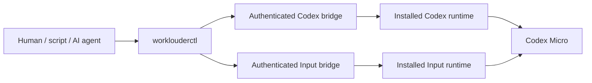

# WorkLouderCTL — Full-Configuration CLI for Codex Micro

<p align="center">
  <strong>Configure Codex Micro and Work Louder Input from one deterministic, agent-ready CLI.</strong>
</p>

<p align="center">
  <a href="README.zh-CN.md">简体中文</a> ·
  <a href="docs/command-reference.md">Commands</a> ·
  <a href="docs/configuration-parity.md">Configuration parity</a> ·
  <a href="docs/compatibility.md">Compatibility</a> ·
  <a href="docs/architecture.md">Architecture</a> ·
  <a href="docs/releases.md">Releases</a>
</p>

<p align="center">
  <a href="https://github.com/MarlinDiary/worklouder-input-cli/actions/workflows/ci.yml"></a>
  
  
  
</p>

WorkLouderCTL replaces the Codex Micro configuration workflows in **Codex** and
**Work Louder Input** with a typed command-line interface. It covers all four
configuration tiers: Codex-native controls, device layouts, Input host actions,
and delegated device operations.

Codex and Input remain the runtime providers for HID/BLE transport, firmware,
Smart Actions, and Codex-aware behavior. WorkLouderCTL adds the repeatable
configuration layer and can relay macOS focus through Codex's connected runtime
for AppSense switching without transferring device ownership.

> [!NOTE]
> Configuration parity is implemented for the verified macOS/Codex Micro
> boundary. Codex `26.727.51351` and Input `0.18.0` have completed real-device
> apply/readback/exact-restore transactions and bidirectional provider handoff.
> The official `v0.1.1` release provides signed and notarized Apple Silicon and
> Intel binaries. Install it from the stable Homebrew tap or with the verified
> binary installer below.

## What it covers

| Area | Capabilities |
| --- | --- |
| **Codex configuration** | Agent source, six Agent Keys, six Command Keys, tap behavior, voice mode, dial, joystick, global lighting, layout reset, runtime health and recovery |
| **Input device configuration** | Profiles, six layers, key matrix, encoder, radial joystick, Actions, Multi Actions, groups, presets, backlight, underglow and layer metadata |
| **Input host configuration** | Smart Actions, Smart Action groups, AppSense links/runtime checks, Cheat Sheet, radial-menu inspection and command permission |
| **Input operations** | Device/firmware status, permissions, sanitized logs, firmware plans and delegated update/reset/recovery workflows |
| **Transactions** | Immutable backups, exact diffs, revision CAS, idempotent retries, readback, postflight checks, automatic reverse rollback and manual restore |
| **Automation** | Stable JSON output, JSON Schemas, shell-free agent envelopes and generated Bash/Zsh/Fish completions |

The complete row-by-row acceptance record is in the
[configuration parity matrix](docs/configuration-parity.md).

## Install

### Homebrew

[Homebrew 6 requires explicit trust](https://docs.brew.sh/Tap-Trust) for
non-official taps. Using the fully qualified formula grants trust only to
WorkLouderCTL:

```console
brew tap MarlinDiary/tap
brew install MarlinDiary/tap/worklouderctl
worklouderctl version
```

### Verified binary installer

Download the installer for review, then run it. It verifies the release
checksum, fixed archive inventory, manifest, Developer ID signature, and binary
version before installing to `~/.local`:

```console
curl -fsSLO https://raw.githubusercontent.com/MarlinDiary/worklouder-input-cli/main/install.sh
sh install.sh
~/.local/bin/worklouderctl version
```

Use `sh install.sh --help` to select a version or prefix. Add
`$HOME/.local/bin` to `PATH` if it is not already present.

### From source

Requirements:

- macOS
- Rust 1.61 or newer
- installed Codex and Work Louder Input applications
- Node.js 22 or newer for the embedded provider runtime's global WebSocket API

```console
git clone https://github.com/MarlinDiary/worklouder-input-cli.git
cd worklouder-input-cli
cargo build --release --locked
./target/release/worklouderctl version
```

Install the authenticated provider integrations and verify the machine:

```console
./target/release/worklouderctl provider install codex
./target/release/worklouderctl provider install input
./target/release/worklouderctl provider status
./target/release/worklouderctl doctor --strict
```

`configurationReady: true` means both provider bridges advertise every required
apply and restore capability for the installed versions.

The deterministic dual-architecture archives, signature checks, notarization
workflow, installer, and automatically updated Homebrew formula are live. See
the [release guide](docs/releases.md) for verification and packaging details.

## Core workflows

### Inspect provider and device state

```console
worklouderctl provider status
worklouderctl doctor --strict
worklouderctl device status
worklouderctl device files
```

### Preserve or explicitly switch the device owner

`device status/files/export`, `device config snapshot/validate/apply/restore`,
and coordinated transactions default to `--owner auto`. They detect the current
owner and use that provider's already-connected session, so configuration no
longer requires a handoff. An explicit switch remains available when wanted:

```console
worklouderctl provider handoff input
worklouderctl device status
worklouderctl provider handoff codex
```

Input is launched as a hidden user-scoped provider during handoff. The CLI uses
private authenticated sockets and validates the returned provider/action
identity before accepting a result. It never performs an implicit handoff.

### Keep Codex connected during AppSense switching

Bind applications to layers in the device configuration, then install the
event-driven focus relay:

```console
worklouderctl provider handoff codex
worklouderctl device config snapshot --owner codex --output before.json
worklouderctl appsense link \
  --input before.json --profile 0 --layer 1 \
  --name Notion --process notion.id --path /Applications/Notion.app \
  --output candidate.json
worklouderctl device config apply --owner codex \
  --input candidate.json --backup pre-apply.json \
  --expected-revision REVISION
worklouderctl appsense relay install
worklouderctl appsense relay status
worklouderctl appsense relay test
worklouderctl appsense relay sync
```

The relay keeps one authenticated socket open, observes macOS `becameFrontmost`
events, and forwards the application identity through Codex's existing
connected device API. Bounded timeout retries keep the same service; transport
failure triggers one serialized bridge recovery. Codex remains the selected
device runtime, so application/Codex layer switches keep the same comm/API identities
and HID/joystick subscriptions. `relay status` exposes functional health and
`relay test` verifies one focus round trip. The same `--owner codex` path gives
device configuration snapshot/apply/restore immutable backups, persistent
idempotency, exact readback, automatic rollback, atomic multi-file gating, and
connection-continuity checks. Use
`worklouderctl appsense relay remove` to remove the LaunchAgent.

### Back up, edit and apply the current device configuration

```console
worklouderctl device config snapshot --output before.json

worklouderctl profile create \
  --input before.json --name "Development" --output candidate.json
worklouderctl config diff before.json candidate.json

worklouderctl device config apply \
  --input candidate.json \
  --backup pre-apply.json \
  --expected-revision REVISION \
  --idempotency-key development-profile-v1
```

Each semantic editor produces a new candidate file. The source snapshot remains
unchanged until an explicit transactional apply. With the default `--owner
auto`, this workflow stays on Codex when Codex is connected and stays on Input
when Input is connected.

### Configure Codex-native controls

```console
worklouderctl codex config snapshot --output codex-before.json

worklouderctl codex voice set \
  --input codex-before.json realtime --output codex-voice.json
worklouderctl codex lighting brightness set \
  --input codex-voice.json 80 --output codex-candidate.json
worklouderctl codex config diff codex-before.json codex-candidate.json

worklouderctl codex config apply \
  --input codex-candidate.json --backup codex-pre-apply.json
```

The same command family covers Agent Keys, Command Keys, dial gestures,
joystick directions, voice behavior, global lighting and whole-layout reset.
The Codex layer's reserved `KV_OAI_*` device assignments remain read-only in
Input `control set`; inspect them with `control list/show` and configure their
behavior through these Codex-native commands.

### Run a coordinated four-authority transaction

```console
worklouderctl transaction plan \
  --codex-settings-base codex-before.json \
  --codex-settings-candidate codex-after.json \
  --codex-agent-keys-base agent-before.json \
  --codex-agent-keys-candidate agent-after.json \
  --input-config-base input-before.json \
  --input-config-candidate input-after.json \
  --input-host-settings-base host-before.json \
  --input-host-settings-candidate host-after.json \
  --output plan.json

worklouderctl transaction apply \
  --plan plan.json \
  --backup-dir backups \
  --receipt receipt.json \
  --idempotency-key workspace-layout-v1
```

The transaction engine preflights every authority, writes in dependency order,
checks exact post-state and reverses completed writes after a failed step.

## AI and automation

Human scripts and AI agents use the same parser and transaction core.
`worklouderctl agent` accepts a shell-free JSON envelope, validates expected
exit statuses and returns bounded stdout/stderr with a typed result.

```console
worklouderctl --json capability list
worklouderctl --json schema list
worklouderctl --json agent validate --input command.json
worklouderctl --json agent execute --input command.json > result.json
```

There is one mutation path for every client: snapshot, candidate, diff, apply,
readback and rollback.

## Architecture



This split keeps upstream transport, firmware and runtime improvements while
making configuration deterministic and reviewable. Provider adapters are
version/hash gated; a newly detected build starts with inspection and capability
discovery before mutations are enabled.

## Safety model

Every guarded write follows the same contract:

1. read the current state from every affected authority;
2. publish an immutable private backup;
3. validate references, versions and limits;
4. show an exact diff;
5. reject stale revisions immediately before writing;
6. apply through the provider-owned serialized queue;
7. read back the complete post-state;
8. restore automatically after a failed mutation;
9. emit a receipt and runnable manual restore path.

Unknown fields are preserved, credentials stay outside snapshots, sockets and
tokens use private filesystem modes, and diagnostic bundles are sanitized before
publication.

## Verified compatibility boundary

| Component | Verified boundary |
| --- | --- |
| Platform | macOS, Apple Silicon and Intel packaging |
| Device | Work Louder Codex Micro over USB |
| Codex | `26.727.51351` exact-release overlay |
| Work Louder Input | `0.18.0` exact-release overlay; `0.17.3` sanitized schema fixture |
| Rust | MSRV `1.61`; current stable CI |
| Node.js | `>=22` provider runtime; `>=18` Companion conformance runtime |

Run `worklouderctl doctor --strict` against the current machine instead of
inferring support from an installed application name. See
[compatibility](docs/compatibility.md) for the capability-gating policy.

## Documentation

- [Complete command reference](docs/command-reference.md)
- [Configuration parity matrix](docs/configuration-parity.md)
- [Configuration model](docs/configuration-reference.md)
- [Tier model](docs/tier-model.md)
- [Architecture](docs/architecture.md)
- [Companion Bridge](docs/companion-bridge.md)
- [Transactions and rollback](docs/transactions.md)
- [Compatibility policy](docs/compatibility.md)
- [JSON Schemas](docs/json-schemas.md)
- [Release and Homebrew guide](docs/releases.md)
- [FAQ](docs/faq.md)
- [Changelog](CHANGELOG.md)

## Development

```console
cargo fmt --check
cargo test --locked
cargo clippy --all-targets -- -D warnings
cargo +1.61.0 test --locked
(cd companion && npm test)
node --test \
  scripts/live-bridge-cdp.test.mjs \
  scripts/provider-lock.test.mjs \
  scripts/provider-state.test.mjs
```

Changes that touch provider behavior should include a baseline, exact commands
and outputs, tested version boundaries, readback evidence and rollback results.
See [CONTRIBUTING.md](CONTRIBUTING.md).

## Independence

WorkLouderCTL is an independent community project. It is affiliated with neither
Work Louder nor OpenAI. Product names identify compatibility targets.

## License

[MIT](LICENSE)
