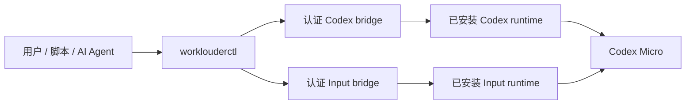

# WorkLouderCTL：Codex Micro 全配置 CLI

<p align="center">
  <strong>使用一个确定性、适合 Agent 调用的 CLI 配置 Codex Micro 与 Work Louder Input。</strong>
</p>

<p align="center">
  <a href="README.md">English</a> ·
  <a href="docs/command-reference.md">命令参考</a> ·
  <a href="docs/configuration-parity.md">配置覆盖矩阵</a> ·
  <a href="docs/compatibility.md">兼容性</a> ·
  <a href="docs/architecture.md">架构</a> ·
  <a href="docs/releases.md">发布</a>
</p>

<p align="center">
  <a href="https://github.com/MarlinDiary/worklouder-input-cli/actions/workflows/ci.yml"></a>
  
  
  
</p>

WorkLouderCTL 使用类型化命令行接口替代 **Codex** 与 **Work Louder Input**
中的 Codex Micro 配置流程。它覆盖四个配置层级：Codex 原生控制、设备布局、
Input 主机动作，以及由 Input 执行的设备操作。

Codex 和 Input 继续负责 HID/BLE、固件、Smart Actions 与 Codex 原生运行时
行为。WorkLouderCTL 提供可复现的配置层，并可通过 Codex 已连接的运行时转发
macOS 前台应用，从而在不转移设备所有权的情况下执行 AppSense 切层。

> [!NOTE]
> 当前已在经过验证的 macOS/Codex Micro 边界内实现完整配置覆盖。Codex
> `26.727.51351` 与 Input `0.18.0` 已通过真实设备写入、读回、精确恢复以及
> 双向 provider handoff。正式 `v0.1.0` 已提供签名且通过 Apple 公证的 Apple
> Silicon 与 Intel 二进制；可以通过稳定 Homebrew tap 或下方校验型安装器安装。

## 功能覆盖

| 范围 | 能力 |
| --- | --- |
| **Codex 配置** | Agent source、六个 Agent Keys、六个 Command Keys、点击行为、语音模式、旋钮、摇杆、全局灯光、布局重置、运行时诊断与恢复 |
| **Input 设备配置** | Profile、六层 Layer、按键矩阵、Encoder、径向摇杆、Actions、Multi Actions、分组、Preset、背光、底光和 Layer 元数据 |
| **Input 主机配置** | Smart Actions、Smart Action 分组、AppSense 链接与运行时检查、Cheat Sheet、Radial Menu 检查和 Command 权限 |
| **Input 设备操作** | 设备与固件状态、权限、脱敏日志、固件计划，以及委托给 Input 的升级、重置和恢复流程 |
| **事务** | 不可变备份、精确 diff、revision CAS、幂等重试、读回、postflight、自动逆序回滚和手动恢复 |
| **自动化** | 稳定 JSON、JSON Schema、无 shell Agent envelope，以及 Bash/Zsh/Fish completion |

逐项验收结果参见[配置覆盖矩阵](docs/configuration-parity.md)。

## 安装

### Homebrew

[Homebrew 6 对非官方 tap 要求显式信任](https://docs.brew.sh/Tap-Trust)。使用完整
formula 名只信任 WorkLouderCTL 这一项：

```console
brew tap MarlinDiary/tap
brew install MarlinDiary/tap/worklouderctl
worklouderctl version
```

### 校验型二进制安装器

先下载并查看安装器，再运行。安装器会在写入 `~/.local` 前校验 release
checksum、固定压缩包清单、manifest、Developer ID 签名与二进制版本：

```console
curl -fsSLO https://raw.githubusercontent.com/MarlinDiary/worklouder-input-cli/main/install.sh
sh install.sh
~/.local/bin/worklouderctl version
```

使用 `sh install.sh --help` 选择版本或安装前缀。如果尚未配置，请把
`$HOME/.local/bin` 加入 `PATH`。

### 从源码安装

需要：

- macOS
- Rust 1.61 或更新版本
- 已安装 Codex 与 Work Louder Input
- Node.js 22 或更新版本，用于内嵌 provider runtime 的 global WebSocket API

```console
git clone https://github.com/MarlinDiary/worklouder-input-cli.git
cd worklouder-input-cli
cargo build --release --locked
./target/release/worklouderctl version
```

安装认证 provider integration，并检查当前电脑：

```console
./target/release/worklouderctl provider install codex
./target/release/worklouderctl provider install input
./target/release/worklouderctl provider handoff codex
./target/release/worklouderctl doctor --strict
```

当 `configurationReady: true` 时，两个 provider bridge 都已经为当前安装版本
提供完整的 apply 和 restore 能力。

双架构确定性压缩包、签名检查、公证 workflow、安装器与自动更新的 Homebrew
formula 均已投入使用。验证和本地打包边界参见[发布指南](docs/releases.md)。

## 核心工作流

### 检查 provider 与设备状态

```console
worklouderctl provider status
worklouderctl doctor --strict
worklouderctl device status
worklouderctl device files
```

### 切换设备所有权

同一时间只有一个 provider 持有 Codex Micro session：

```console
worklouderctl provider handoff input
worklouderctl device status
worklouderctl provider handoff codex
```

Handoff 期间，Input 以隐藏的用户级 provider 运行。CLI 通过私有认证 socket
通信，并验证返回结果中的 provider 与 action identity。

### AppSense 切层时保持 Codex 连接

先在设备配置中把应用绑定到 Layer，再安装事件驱动的前台应用 relay：

```console
worklouderctl provider handoff codex
worklouderctl device config snapshot --owner codex --output before.json
worklouderctl appsense link \
  --input before.json --profile 0 --layer 1 \
  --name Notion --process notion.id --path /Applications/Notion.app \
  --output candidate.json
worklouderctl device config apply --owner codex \
  --input candidate.json --backup pre-apply.json \
  --expected-revision REVISION
worklouderctl appsense relay install
worklouderctl appsense relay status
worklouderctl appsense relay sync
```

Relay 监听 macOS `becameFrontmost` 事件，并通过 Codex 当前已连接的设备 API
转发应用 identity。Codex 始终是唯一 USB owner，应用层与 Codex 层切换时不会
停止 HID 或 joystick subscription。`--owner codex` 也为设备配置的
snapshot/apply/restore 提供不可变备份、精确读回、自动回滚与连接连续性检查。运行
`worklouderctl appsense relay remove` 可删除 LaunchAgent。

### 备份、修改并应用 Input 配置

```console
worklouderctl provider handoff input
worklouderctl device config snapshot --output before.json

worklouderctl profile create \
  --input before.json --name "Development" --output candidate.json
worklouderctl config diff before.json candidate.json

worklouderctl device config apply \
  --input candidate.json \
  --backup pre-apply.json \
  --expected-revision REVISION \
  --idempotency-key development-profile-v1
```

每个语义编辑命令都会生成新的 candidate 文件。只有显式事务写入才会改变实时配置。

### 配置 Codex 原生控制

```console
worklouderctl codex config snapshot --output codex-before.json

worklouderctl codex voice set \
  --input codex-before.json realtime --output codex-voice.json
worklouderctl codex lighting brightness set \
  --input codex-voice.json 80 --output codex-candidate.json
worklouderctl codex config diff codex-before.json codex-candidate.json

worklouderctl codex config apply \
  --input codex-candidate.json --backup codex-pre-apply.json
```

同一命令族还覆盖 Agent Keys、Command Keys、旋钮手势、摇杆方向、语音、
全局灯光和完整布局重置。

### 四 authority 协调事务

```console
worklouderctl transaction plan \
  --codex-settings-base codex-before.json \
  --codex-settings-candidate codex-after.json \
  --codex-agent-keys-base agent-before.json \
  --codex-agent-keys-candidate agent-after.json \
  --input-config-base input-before.json \
  --input-config-candidate input-after.json \
  --input-host-settings-base host-before.json \
  --input-host-settings-candidate host-after.json \
  --output plan.json

worklouderctl transaction apply \
  --plan plan.json \
  --backup-dir backups \
  --receipt receipt.json \
  --idempotency-key workspace-layout-v1
```

事务引擎会预检所有 authority，按依赖顺序写入，验证完整 post-state，并在步骤
失败后逆序恢复已经完成的写入。

## AI 与自动化

人工脚本和 AI Agent 使用同一套 parser 与 transaction core。
`worklouderctl agent` 接收无 shell 的 JSON envelope，验证预期退出状态，并返回
有界 stdout/stderr 与类型化结果。

```console
worklouderctl --json capability list
worklouderctl --json schema list
worklouderctl --json agent validate --input command.json
worklouderctl --json agent execute --input command.json > result.json
```

所有客户端共享同一条 mutation 路径：snapshot、candidate、diff、apply、readback、
rollback。

## 架构



这种分工保留上游 transport、firmware 与 runtime 更新，同时让配置变得确定、
可审查。Provider adapter 受版本与 hash gate 约束；检测到新 build 时，CLI 会先
完成检查和 capability discovery，再启用 mutation。

## 安全模型

每次受保护写入都遵循同一份契约：

1. 从所有相关 authority 读取当前状态；
2. 发布私有、不可变备份；
3. 校验引用、版本和限制；
4. 展示精确 diff；
5. 写入前拒绝过期 revision；
6. 通过 provider 自己的序列化队列写入；
7. 读回完整 post-state；
8. mutation 失败后自动恢复；
9. 输出 receipt 和可运行的手动恢复路径。

CLI 会保留未知字段；凭据与 snapshot 分离；socket/token 使用私有文件权限；
诊断包在发布前完成脱敏。

## 已验证兼容边界

| 组件 | 已验证边界 |
| --- | --- |
| 平台 | macOS；Apple Silicon 与 Intel 打包 |
| 设备 | Work Louder Codex Micro USB |
| Codex | `26.727.51351` 精确版本 overlay |
| Work Louder Input | `0.18.0` 精确版本 overlay；`0.17.3` 脱敏 schema fixture |
| Rust | MSRV `1.61`；current stable CI |
| Node.js | `>=22` provider runtime；`>=18` Companion conformance runtime |

请使用 `worklouderctl doctor --strict` 检查当前电脑，而不是仅根据应用名称推断支持。
Capability gate 策略参见[兼容性文档](docs/compatibility.md)。

## 文档

- [完整命令参考](docs/command-reference.md)
- [配置覆盖矩阵](docs/configuration-parity.md)
- [配置模型](docs/configuration-reference.md)
- [Tier 模型](docs/tier-model.md)
- [架构](docs/architecture.md)
- [Companion Bridge](docs/companion-bridge.md)
- [事务与回滚](docs/transactions.md)
- [兼容性策略](docs/compatibility.md)
- [JSON Schema](docs/json-schemas.md)
- [发布与 Homebrew](docs/releases.md)
- [FAQ](docs/faq.md)
- [Changelog](CHANGELOG.md)

## 开发

```console
cargo fmt --check
cargo test --locked
cargo clippy --all-targets -- -D warnings
cargo +1.61.0 test --locked
(cd companion && npm test)
node --test \
  scripts/live-bridge-cdp.test.mjs \
  scripts/provider-lock.test.mjs \
  scripts/provider-state.test.mjs
```

涉及 provider 行为的改动需要附带 baseline、精确命令与输出、已测试版本边界、
读回证据和 rollback 结果。参见 [CONTRIBUTING.md](CONTRIBUTING.md)。

## 项目独立性

WorkLouderCTL 是独立社区项目，与 Work Louder 和 OpenAI 均无隶属关系。产品名称
仅用于说明兼容目标。

## License

[MIT](LICENSE)
